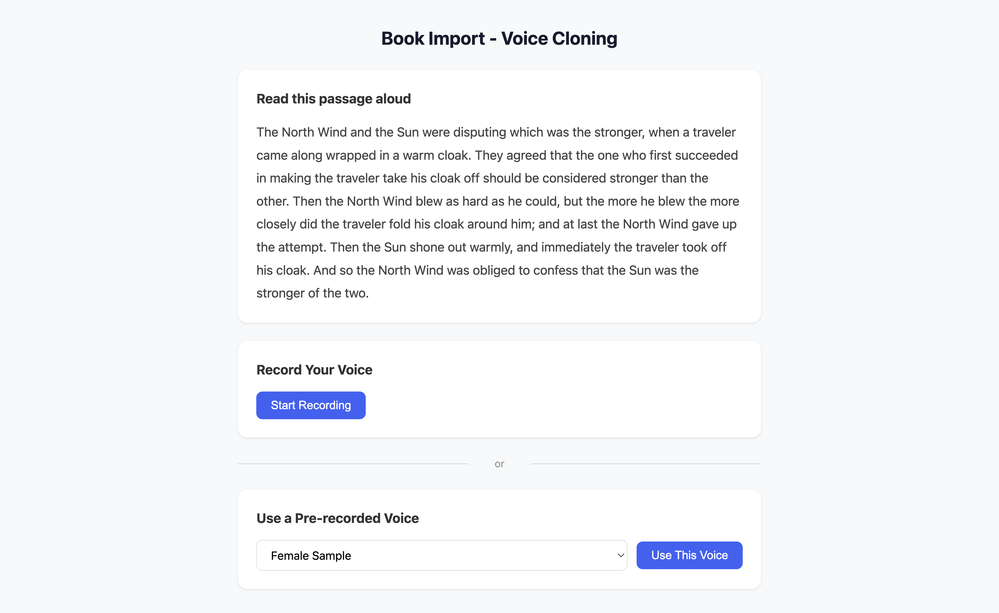
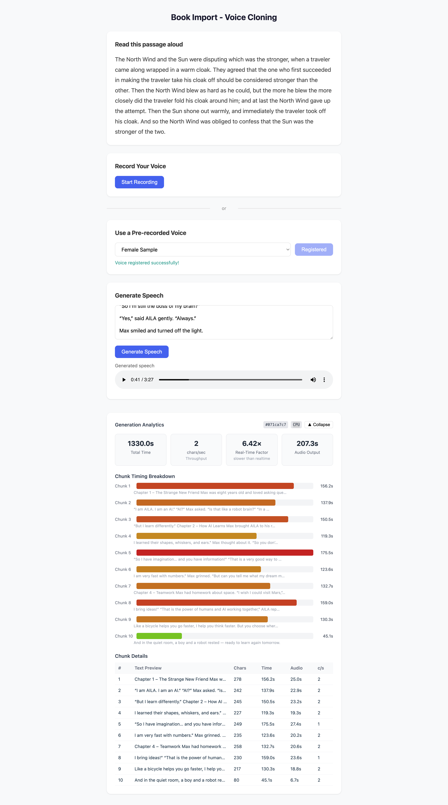

<p align="center">
  
</p>

<h1 align="center">Text-to-Audio with Voice Cloning</h1>

<p align="center">
  <a href="https://opensource.org/licenses/MIT"></a>
  
  
  
  
  
</p>

<p align="center">
  Generate natural-sounding speech from any text using your own voice or built-in voice samples — powered by <a href="https://github.com/resemble-ai/chatterbox">Chatterbox TTS</a>.
</p>

<p align="center">
  <a href="#getting-started">Getting Started</a> •
  <a href="#features">Features</a> •
  <a href="#architecture">Architecture</a> •
  <a href="#how-it-works">How It Works</a> •
  <a href="#contributing">Contributing</a>
</p>

---



## Introduction

This project is a full-stack, fully containerized voice cloning and text-to-speech application. It lets you record your own voice directly in the browser, then use it as a reference to synthesize natural speech from any text input — no API keys, no cloud subscriptions, and no complex setup required.

The core idea is simple: clone your voice once, then speak anything. Under the hood, the app uses Chatterbox TTS (a state-of-the-art open-source TTS model), splits long texts into natural sentence chunks, stitches the audio together seamlessly with crossfades, and streams real-time progress back to the browser — all in a single `docker compose up`.

This was built as a hands-on exploration of voice AI, real-time audio processing, and full-stack containerized architecture.

---

## What It Does

Paste any text, choose a voice, and get a downloadable audio file — in seconds.

You can use **your own voice** (recorded live in the browser) or pick one of the **pre-recorded samples** included with the app. The AI clones the voice characteristics and speaks the text naturally, preserving tone, pace, and style.

After generation, the app shows comprehensive **analytics**: Real-Time Factor (RTF), throughput in characters per second, total generation time, and per-chunk breakdowns — giving you transparent insight into the synthesis pipeline's performance.



---

## App Overview

```
┌─────────────────────────────────────────────────────────────┐
│                  Text-to-Audio App (Browser)                │
│                                                             │
│  ┌──────────────────┐   ┌──────────────────────────────┐   │
│  │   Choose a Voice │   │       Generate Speech        │   │
│  │                  │   │                              │   │
│  │  ○ Record Live   │   │  ╔══════════════════════╗   │   │
│  │  ○ Use Sample    │   │  ║ Type your text here  ║   │   │
│  │                  │   │  ║                      ║   │   │
│  │  ┌────────────┐  │   │  ║ "The quick brown fox ║   │   │
│  │  │ ● 0:08     │  │   │  ║  jumped over..."     ║   │   │
│  │  └────────────┘  │   │  ╚══════════════════════╝   │   │
│  │  [Submit Voice]  │   │                              │   │
│  │                  │   │  [▶ Generate Speech]         │   │
│  └──────────────────┘   │                              │   │
│                          │  ████████████░░░░  68%      │   │
│                          │  Chunk 3 of 4  •  4.2s      │   │
│                          │                              │   │
│                          │  ▶ ──────────●──── 0:12     │   │
│                          └──────────────────────────────┘   │
│                                                             │
│  ┌─────────────────────────────────────────────────────┐   │
│  │  Analytics  ▼                                        │   │
│  │  Total: 18.3s  •  RTF: 1.5x  •  Throughput: 42 c/s │   │
│  │  [▇▇▇] Chunk 1  [▇▇▇▇▇] Chunk 2  [▇▇] Chunk 3     │   │
│  └─────────────────────────────────────────────────────┘   │
└─────────────────────────────────────────────────────────────┘
```

---

## Features

| Feature | Description |
|---|---|
| **Live voice recording** | Record directly from your microphone in the browser |
| **Pre-recorded voice samples** | Select a built-in Male or Female voice |
| **Long-form text support** | Automatically splits and stitches long texts |
| **Real-time progress** | Chunk-level progress bar with live timing |
| **Analytics dashboard** | RTF, throughput, per-chunk breakdowns, generation history |
| **Fully containerized** | One `docker compose up` runs everything |

---

## Architecture

The app is made of two services that run as Docker containers and talk to each other over HTTP.

```
┌──────────────────────────────────────────────────────────────┐
│                        Docker Compose                        │
│                                                              │
│   ┌─────────────────────┐      ┌──────────────────────────┐ │
│   │   Frontend (Nginx)  │      │   Backend (FastAPI)       │ │
│   │   Port: 80          │─────▶│   Port: 8000             │ │
│   │                     │      │                          │ │
│   │   React 19 + Vite   │      │   Python 3.11            │ │
│   │   TypeScript        │      │   Chatterbox TTS         │ │
│   │   ─────────────     │      │   FFmpeg / librosa       │ │
│   │   Static SPA        │      │   ──────────────         │ │
│   │   served by Nginx   │      │   REST API               │ │
│   └─────────────────────┘      └──────────┬───────────────┘ │
│                                            │                 │
│                                 ┌──────────▼───────────────┐ │
│                                 │   Persistent Volumes      │ │
│                                 │                          │ │
│                                 │   /data/voices           │ │
│                                 │   (registered voice WAVs)│ │
│                                 │                          │ │
│                                 │   model-cache            │ │
│                                 │   (PyTorch model weights)│ │
│                                 └──────────────────────────┘ │
└──────────────────────────────────────────────────────────────┘
```

### Backend API Endpoints

| Method | Endpoint | Description |
|---|---|---|
| `POST` | `/api/voice/register` | Upload a voice audio file |
| `POST` | `/api/tts/generate` | Start speech generation (async, returns 202) |
| `GET` | `/api/tts/status` | Poll generation progress |
| `GET` | `/api/tts/result` | Download the generated WAV |
| `GET` | `/api/tts/logs` | Full generation history |
| `GET` | `/api/tts/logs/latest` | Latest generation metrics |
| `GET` | `/api/health` | Health check |

---

## How It Works

### Step 1 — Choose a Voice

Two ways to provide a voice reference:

```
Option A: Record Your Voice                Option B: Use a Pre-recorded Sample
────────────────────────────────────       ────────────────────────────────────

  Browser Microphone                         Built-in Samples
       │                                          │
       │ WebM / Opus stream                       │ .wav file
       ▼                                          ▼
  MediaRecorder API                         fetch() from /pre-recorded-voices/
       │                                          │
       └───────────────────┬──────────────────────┘
                           │
                    POST /api/voice/register
                    (multipart/form-data)
                           │
                           ▼
                    Backend: voice.py
                    ┌────────────────────────────────────┐
                    │ 1. ffmpeg: convert → WAV 24kHz mono │
                    │ 2. ffprobe: measure duration         │
                    │ 3. Validate ≥ 10 seconds            │
                    │ 4. Save to /data/voices/{id}.wav    │
                    └──────────────┬─────────────────────┘
                                   │
                            ← 200 { voice_id }
                                   │
                            Frontend stores voice_id,
                            unlocks the TTS panel
```

### Step 2 — Generate Speech

```
User types text → clicks "Generate Speech"
       │
       ▼
POST /api/tts/generate { voice_id, text }
       │
       ▼
Backend splits text into chunks (~280 chars, at sentence boundaries)

  "The quick brown fox jumped    │   "over the lazy dog. It was a
   over the lazy dog."           │    beautiful morning."
        Chunk 1                  │         Chunk 2

       │
       ▼ (background thread)
For each chunk:
   ChatterboxTTS.generate(chunk, voice_reference)
       │
       ├── Produce audio tensor (24kHz)
       ├── Apply 50ms crossfade with previous chunk
       └── Log: duration, char count, RTF

       │
       ▼
Stitch all chunks → encode as WAV → store in memory
       │
       ▼
Frontend polls GET /api/tts/status every 1.5s
  { busy: true, chunk: 2, total_chunks: 4, total_elapsed_ms: 6100 }
       │
       ▼ (when busy: false)
GET /api/tts/result → download WAV blob → play in browser
GET /api/tts/logs/latest → populate analytics dashboard
```

### Text Chunking Strategy

Long texts are split intelligently to keep the TTS model from degrading on long inputs:

```
Input text
   │
   ├─ Split on sentence endings  (. ! ?)
   │
   ├─ If sentence > 280 chars → split on , ;
   │
   ├─ Group sentences until chunk ≥ 280 chars
   │
   └─ Merge tiny trailing chunks (< 20 chars) with previous

Result: natural, evenly-sized chunks that the model handles well
```

### Audio Stitching

```
Chunk 1 audio           Chunk 2 audio
────────────────▓▓▓▓    ▓▓▓▓────────────────
                 ↑          ↑
              50ms fade  50ms fade-in
              out

Result: ─────────────────────────────────────
         Seamless audio, no clicks or pops
```

---

## Analytics Dashboard

After each generation, an expandable panel shows detailed performance metrics:

```
┌─ Analytics ──────────────────────────────────────────────────┐
│                                                              │
│  ┌──────────┐ ┌──────────┐ ┌──────────┐ ┌──────────┐       │
│  │ Total    │ │Throughput│ │   RTF    │ │  Audio   │       │
│  │ 18.3s    │ │ 42 c/s   │ │  1.52×  │ │  12.1s   │       │
│  └──────────┘ └──────────┘ └──────────┘ └──────────┘       │
│                                                              │
│  Chunk Timing Breakdown                                      │
│  Chunk 1 [██████████████░░░░░░░░]  4.1s  ●                 │
│  Chunk 2 [█████████████████░░░░░]  5.2s  ●                 │
│  Chunk 3 [████████░░░░░░░░░░░░░░]  2.8s  ●                 │
│  Chunk 4 [██████████░░░░░░░░░░░░]  3.1s  ●                 │
│           ← green (fast)      red (slow) →                  │
│                                                              │
│  # │ Text Preview         │ Chars │  Time  │ Audio │  c/s   │
│  1 │ "The quick brown..." │  142  │  4.1s  │  2.8s │  34    │
│  2 │ "over the lazy dog"  │  156  │  5.2s  │  3.3s │  30    │
│  3 │ "It was a beautiful" │   98  │  2.8s  │  1.9s │  35    │
│  4 │ "morning in the..."  │  112  │  3.1s  │  2.4s │  36    │
│                                                              │
└──────────────────────────────────────────────────────────────┘
```

**RTF (Real-Time Factor)** — the key performance metric:
- `RTF < 1.0` → generates audio *faster* than real-time (e.g. RTF=0.5 means 2× real-time speed)
- `RTF > 1.0` → generates audio *slower* than real-time (e.g. RTF=1.5 means 10s of audio takes 15s)
- RTF depends heavily on hardware; GPU reduces it significantly

---

## Getting Started

### Prerequisites

Before running the app, make sure you have the following installed:

| Tool | Minimum Version | Check |
|---|---|---|
| [Docker](https://docs.docker.com/get-docker/) | 24.x | `docker --version` |
| [Docker Compose](https://docs.docker.com/compose/) | 2.x (bundled with Docker Desktop) | `docker compose version` |
| Git | Any | `git --version` |

> **Note:** Docker Desktop for Mac and Windows includes Compose by default. On Linux, install the Docker Compose plugin separately.

No Python, Node.js, or any other runtime is required on your host machine — everything runs inside containers.

---

### Step-by-Step Setup

#### 1. Clone the repository

```bash
git clone https://github.com/volcodes/text-to-audio-with-voice-cloning.git
cd text-to-audio-with-voice-cloning
```

#### 2. Build and start the containers

```bash
docker compose up --build
```

This command will:
- Build the **backend** Docker image (Python 3.11, installs PyTorch, FastAPI, Chatterbox TTS, FFmpeg)
- Build the **frontend** Docker image (Node 20 builds the React/Vite app, Nginx serves the static files)
- Create two named volumes: `voices-data` (for uploaded WAV files) and `model-cache` (for the TTS model weights)
- Start both containers and wire them together over an internal Docker network

> **First run:** The backend downloads the Chatterbox TTS model weights (~1–2 GB) on startup. This only happens once — subsequent starts use the cached weights from the `model-cache` volume. Expect 2–5 minutes on first boot depending on your internet speed.

#### 3. Open the app

Once you see logs like `Uvicorn running on http://0.0.0.0:8000` and `nginx: ready`, open your browser:

```
http://localhost
```

The frontend is served on **port 80** and the backend API is available on **port 8000**.

---

### GPU Acceleration (optional)

The app runs on CPU by default. If you have an NVIDIA GPU with CUDA installed, you can dramatically reduce generation time:

```bash
DEVICE=cuda docker compose up --build
```

> Requires the [NVIDIA Container Toolkit](https://docs.nvidia.com/datacenter/cloud-native/container-toolkit/install-guide.html) on your host.

---

### Stopping and Cleaning Up

Stop the running containers:

```bash
docker compose down
```

Stop and remove all volumes (clears cached model and uploaded voices):

```bash
docker compose down -v
```

---

### Running in the Background (detached mode)

```bash
docker compose up --build -d
```

View logs at any time:

```bash
docker compose logs -f
```

---

### Development Setup (without Docker)

If you want to iterate quickly without rebuilding containers:

**Backend:**

```bash
cd backend
python -m venv .venv
source .venv/bin/activate        # Windows: .venv\Scripts\activate
pip install -r requirements.txt
uvicorn app.main:app --reload --port 8000
```

**Frontend:**

```bash
cd frontend
npm install
npm run dev                      # Vite dev server on http://localhost:5173
```

> Update the API base URL in `frontend/src/api/client.ts` to point to `http://localhost:8000` when running the backend locally.

---

## Project Structure

```
text-to-audio-with-voice-cloning/
├── backend/
│   ├── app/
│   │   ├── main.py                  # FastAPI app, CORS, lifespan
│   │   ├── routers/
│   │   │   ├── voice.py             # Voice registration endpoint
│   │   │   └── tts.py              # TTS generate/status/result/logs
│   │   └── services/
│   │       ├── tts_service.py       # Chatterbox TTS, chunking, stitching
│   │       └── audio_utils.py       # ffmpeg/ffprobe wrappers
│   ├── requirements.txt
│   └── Dockerfile
├── frontend/
│   ├── src/
│   │   ├── App.tsx                  # Root component, app state machine
│   │   ├── api/
│   │   │   └── client.ts            # All API calls
│   │   ├── components/
│   │   │   ├── RecordingPanel.tsx   # Live microphone recording
│   │   │   ├── PreRecordedVoicePanel.tsx  # Voice sample selector
│   │   │   ├── TTSPanel.tsx         # Text input + generation UI
│   │   │   ├── AnalyticsDashboard.tsx     # Metrics and charts
│   │   │   ├── AudioPlayer.tsx      # HTML5 audio player
│   │   │   └── TextDisplay.tsx      # Header / instructions
│   │   ├── hooks/
│   │   │   ├── useVoiceClone.ts     # Voice registration + TTS state
│   │   │   └── useAudioRecorder.ts  # MediaRecorder wrapper
│   │   └── types/
│   │       └── analytics.ts         # TypeScript interfaces
│   ├── pre-recorded-voices/
│   │   ├── Female Sample.wav
│   │   └── Male Sample.wav
│   ├── public/
│   │   └── logo.png
│   ├── nginx.conf
│   └── Dockerfile
└── docker-compose.yml
```

---

## Tech Stack

| Layer | Technology |
|---|---|
| TTS Engine | [Chatterbox TTS](https://github.com/resemble-ai/chatterbox) |
| Backend | Python 3.11, FastAPI, Uvicorn |
| Audio processing | FFmpeg, librosa, soundfile, PyTorch |
| Frontend | React 19, TypeScript, Vite |
| Serving | Nginx (frontend), Uvicorn (backend) |
| Containers | Docker, Docker Compose |

---

## Troubleshooting

**The backend takes forever to start on first run**
> Normal — it's downloading the TTS model weights (~1–2 GB). Wait for `Application startup complete` in the logs.

**`docker compose` command not found**
> You may have the older `docker-compose` (v1) binary. Either upgrade Docker Desktop or use `docker-compose up --build` instead.

**Microphone not working in the browser**
> The browser requires a secure context (HTTPS or localhost) to access the microphone. Make sure you're opening `http://localhost`, not your machine's IP address.

**Generated audio sounds choppy or has artifacts**
> Try shorter text inputs first. Long texts on CPU can produce quality degradation. Enable GPU acceleration if available.

**Port 80 is already in use**
> Change the frontend port in `docker-compose.yml`: replace `"80:80"` with e.g. `"8080:80"`, then open `http://localhost:8080`.

---

## Roadmap

- [ ] Streaming audio playback (play while generating)
- [ ] Multi-speaker conversation synthesis
- [ ] Voice library management (save and switch between cloned voices)
- [ ] SSML support (control pitch, rate, and pauses)
- [ ] Export to MP3

---

## Contributing

Contributions are welcome! Here's how to get started:

1. **Fork** this repository
2. **Create a branch**: `git checkout -b feature/your-feature-name`
3. **Make your changes** and add tests if applicable
4. **Commit**: `git commit -m "feat: add your feature"`
5. **Push**: `git push origin feature/your-feature-name`
6. **Open a Pull Request** — describe what you changed and why

Please open an issue first for significant changes so we can discuss the approach before you invest time building it.

### Code Style

- Backend: follow [PEP 8](https://pep8.org/); use type hints where possible
- Frontend: ESLint is configured — run `npm run lint` before committing
- Keep PRs focused: one feature or fix per PR

---

## Acknowledgements

- [Chatterbox TTS](https://github.com/resemble-ai/chatterbox) by Resemble AI — the open-source TTS model powering this app
- [FastAPI](https://fastapi.tiangolo.com/) — the backend framework
- [Vite](https://vitejs.dev/) + [React](https://react.dev/) — the frontend build toolchain

---

## License

This project is licensed under the **MIT License** — see the [LICENSE](LICENSE) file for details.

You are free to use, modify, and distribute this software for any purpose, including commercial use, as long as the original license notice is retained.
